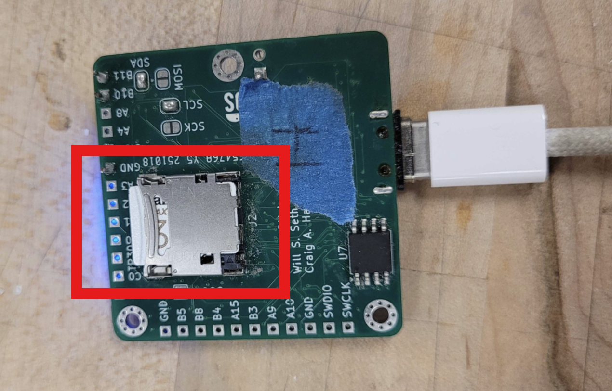
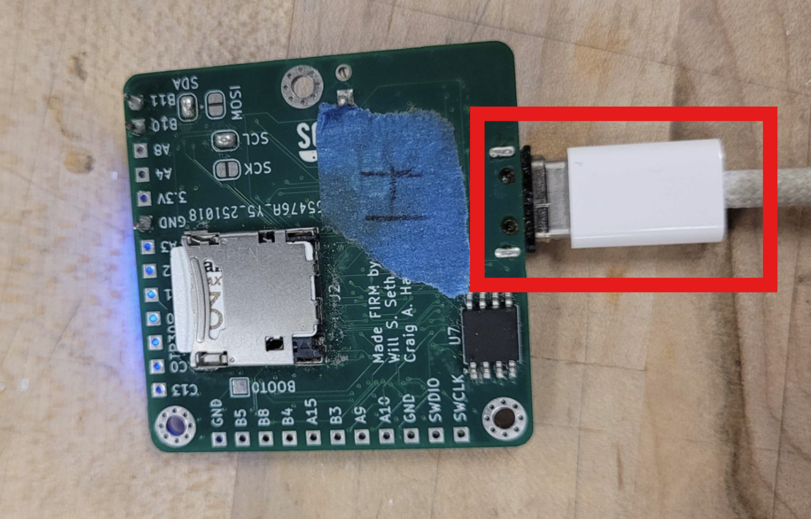
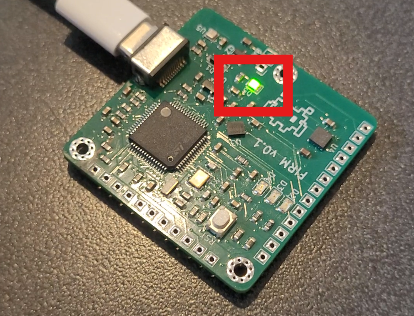

# Using FIRM - Quick Start

This page is for **end users** who have a FIRM device and want to get from:

> "I have this board in my hand"  
> → "I've verified it's reading data, and I've set it up."

This means it will detail how to connect to the FIRM device and use the web app. The **[Configuring Your Device](configuring-firm.md)** page
will go over how to use the web app to change settings and view live data. The **[Logging & Downloading Data](data-logging.md)** page will go
over how to log flight data and download it.

If you want to contribute to the firmware, PCBs, or web app, see **[Contributor Overview](../contributors/overview.md)**.

---

## What You Need

To follow this guide, you should have:

- A **Windows or Linux laptop**.
- One **FIRM device**.
- A **USB-C power + data cable** (Can be USB-C to USB-C, USB-A to USB-C, etc.).
- A **32GB V30 U3 MicroSD card**.

You do **not** need to know how to write code or anything about electronics for this page.

> ⚠️ **Linux Users**  
> This guide is mostly for Windows users. If you're using Linux, you're probably technology-savvy enough to figure
> it out on your own. *Weirdo*.

---

## 🔌 Step 1 - Connect FIRM to Your Computer

1. Insert the MicroSD card into the FIRM device. It uses a clamshell design, so if you have to open it, gently push down on the cover and slide out, then you can open it and place the sd card in it.

2. Plug your cable into your laptop and into the USB-C port on the FIRM device.

3. Confirm that you see a green LED 🟢 (means that it's receiving power). If you see any other color LEDs, that means something isn't working properly. Check the **[Troubleshooting](troubleshooting.md)** page for help.

> ⚠️ **Safety Note**  
> When working with the exposed FIRM board, be careful not to short any components together with any pieces of metal
> such as exposed wires, heat sinks, screws, etc.
>
> If you ever notice a part of the board is very hot, immediately unplug it and assess if there's been a short.

---

## 🌐 Step 2 - Open the Web App

1. Open your browser (we recommend **Chrome** or **Edge**--**Firefox** will not work).
2. Go to **[https://firm.ncsurocketry.org/](https://firm.ncsurocketry.org/)**.
3. The page should load the **FIRM Web App**, which runs entirely in your browser.

> ❌ Eventually there will be a downloadable version of the app for when you don't have an internet connection.

---

## 💻 Step 3 - Connect via Serial

1. In the FIRM Web App click on the `Connect to Firm` button.
2. A dialog should pop up showing available serial ports, click the one corresponding to the FIRM device. The name should contain `STM32` in it.
3. Click **Connect**.

Now you should see that the app has connected to the FIRM device. Confirm you see **live status** from the device by
looking at the graphs.
If not, see **[Troubleshooting](troubleshooting.md)**.

---

If you want to configure your FIRM device, continue to:  
➡️ **[Configuring Your Device](configuring-firm.md)**

---
